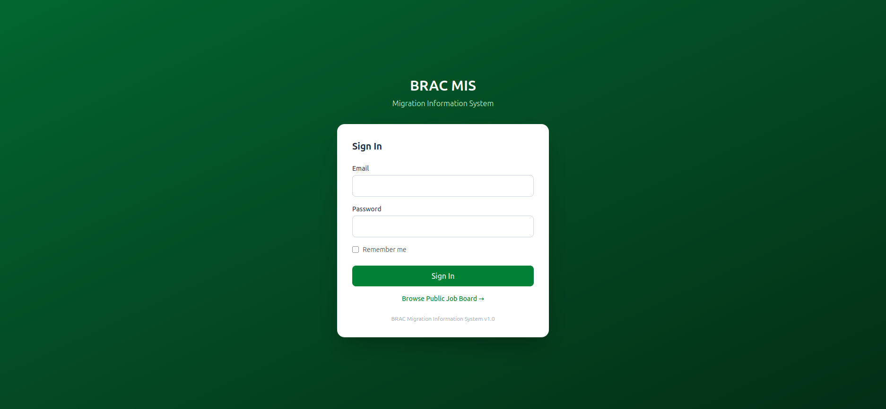
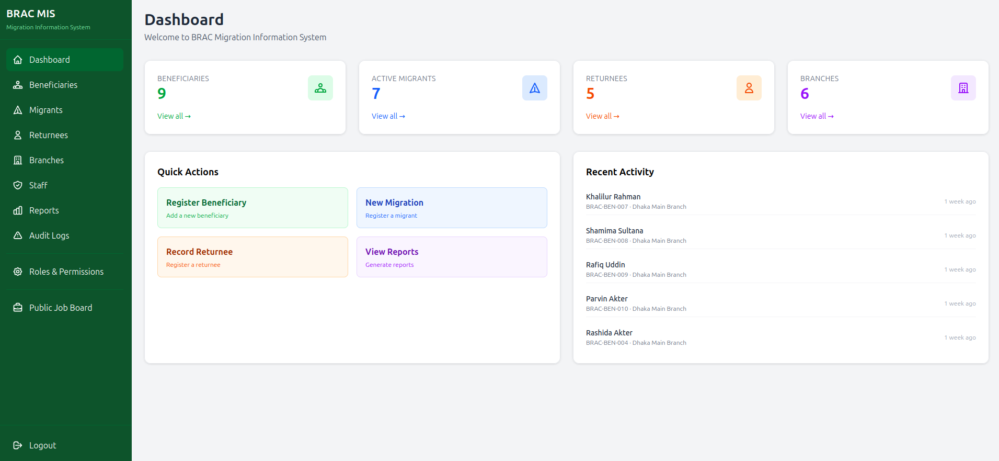
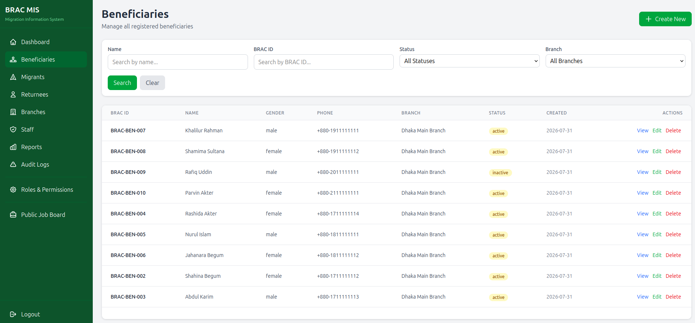
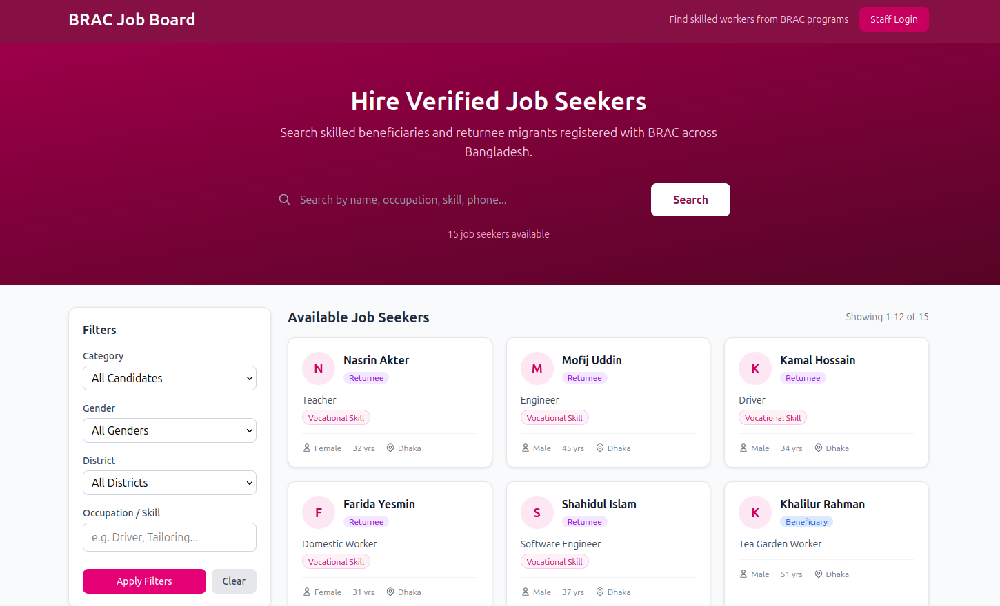
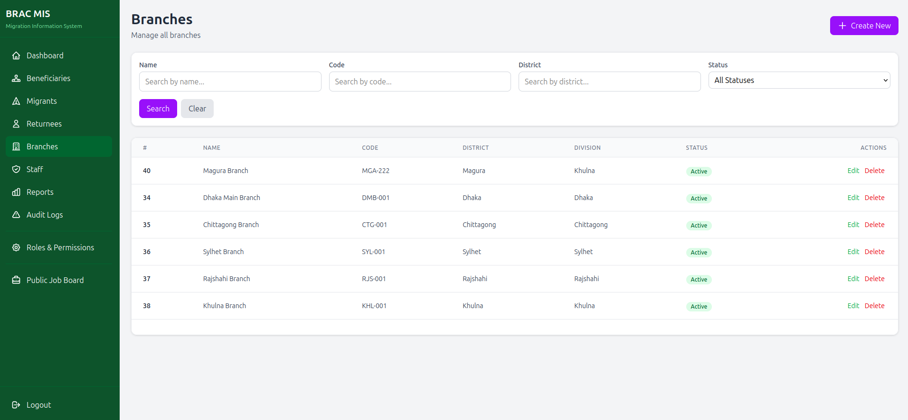
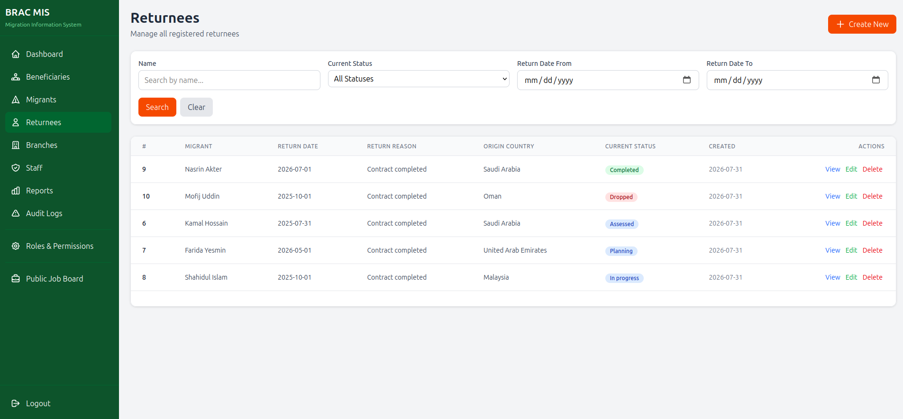
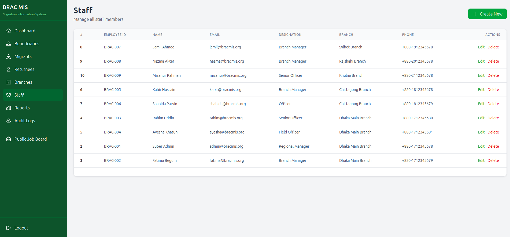
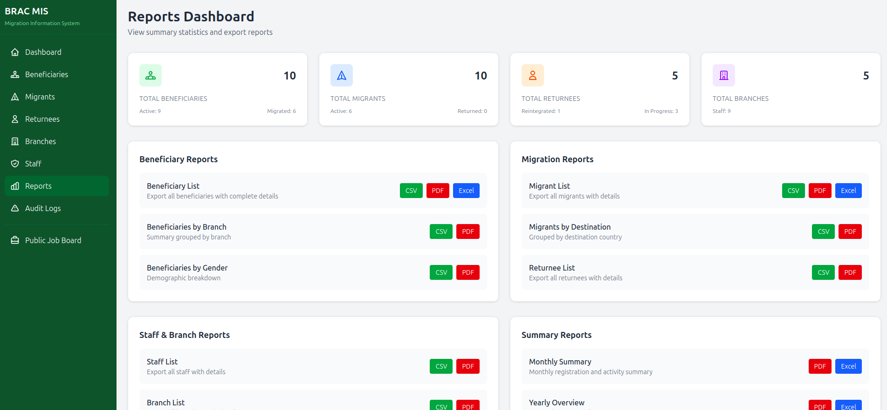
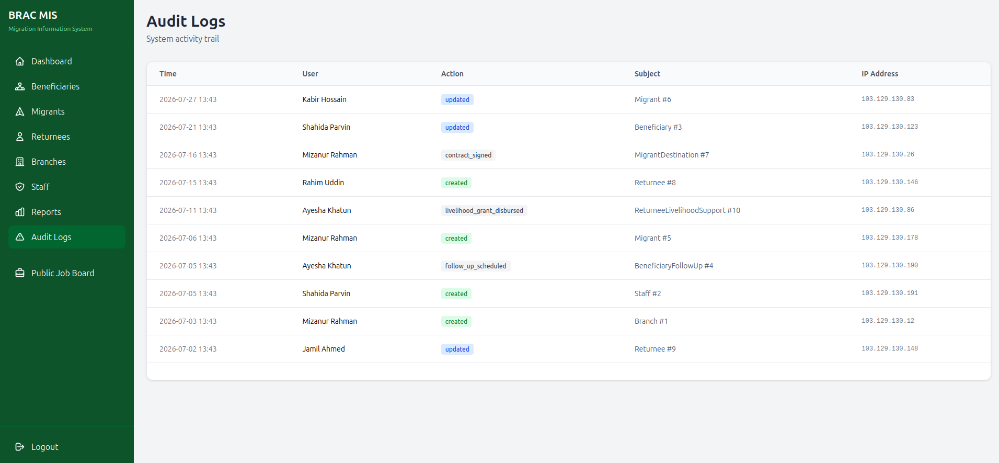

# BRAC Migration & Reintegration Management Information System

A robust Migration & Reintegration Management Information System powered by **Laravel 13**, built for BRAC to track the complete lifecycle of migrant workers — from at-risk beneficiaries and deployed migrants to returnees moving through reintegration. Features role-based access control, a full audit trail, CSV/Excel/PDF exports, a public job board, and a Sanctum-secured REST API.

## Tech Badges


---

## Features

### Core Functionality

| Feature                    | Description                                                                                 |
| -------------------------- | ------------------------------------------------------------------------------------------- |
| **Beneficiary Management** | Full CRUD with households, interventions, follow-ups, document uploads, and branch assignment |
| **Migration Lifecycle**    | Track migrants through statuses (Registered → Pre-Departure → Deployed → Returned/Cancelled) |
| **Reintegration Module**   | Skill assessments, reintegration plans, livelihood support, microfinance, and follow-ups     |
| **Branches & Staff**       | Multi-branch organisation model with staff linked to user accounts and designations         |
| **Role-Based Access**      | spatie/laravel-permission with route-level permission middleware per resource                |
| **Audit Trail**            | Every create/update/delete logged with before/after values and the acting user               |
| **Reports & Exports**      | CSV, Excel, and PDF downloads for every module; every export is logged                       |
| **Public Job Board**       | Public-facing page surfacing eligible beneficiaries and returnees to employers               |

### Data Integrity & Reporting

| Feature                          | Description                                                          |
| -------------------------------- | -------------------------------------------------------------------- |
| **Dashboard KPIs**               | At-a-glance metrics: beneficiaries, deployed migrants, returnees, branches |
| **Searchable List Pages**        | GET filter forms on every index (name, BRAC ID, status, branch, date ranges) |
| **Follow-up Reminders**          | Queued job + notification reminding case officers of due follow-ups   |
| **Document Management**          | Beneficiaries and migrants can store NID scans, passports, contracts  |
| **REST API**                     | Full Sanctum-protected API for all resources plus report summaries    |

### System Architecture

- **Admin Portal** — Full CRUD for beneficiaries, migrants, returnees, branches, and staff with RBAC
- **Public Website** — Job board that surfaces eligible program participants for livelihood matching
- **API Layer** — Sanctum token auth with resource endpoints for future field/mobile apps

---

## Screenshots

### Admin Login



### Admin Dashboard



### Beneficiaries



### BRAC Job Board



### Branches



### Returnees



### Staff



### Reports



### Audit Logs



---

## Tech Stack

| Layer            | Technology                      |
| ---------------- | ------------------------------- |
| Backend          | Laravel 13 (PHP 8.3+)           |
| Frontend         | Blade Templates, Tailwind CSS 4 |
| Build Tool       | Vite 8                          |
| Database         | MySQL 8.0 (Docker)              |
| Cache & Sessions | Redis 7.4                       |
| Authentication   | Laravel sessions + Sanctum      |
| RBAC             | spatie/laravel-permission       |
| Exports          | maatwebsite/excel, dompdf       |
| Containerization | Docker + Docker Compose         |

---

## Project Structure

```
brac-mis/
├── docker-compose.yml            # Full local stack (app, nginx, mysql, redis, phpMyAdmin)
├── docker/
│   ├── php/                      # PHP 8.3-FPM Dockerfile + entrypoint
│   └── nginx/                    # nginx site config
├── screenshots/                  # UI screenshots
└── src/                          # Laravel 13 application
    ├── app/
    │   ├── Http/Controllers/     # 19 controllers (12 web + 7 Api/)
    │   ├── Models/               # 26 Eloquent models
    │   ├── Services/             # Business logic (Audit, Dashboard, Migration, ...)
    │   ├── Jobs/                 # SendFollowUpReminder
    │   └── Notifications/        # FollowUpReminder
    ├── database/
    │   ├── migrations/           # 34 migrations (40+ tables)
    │   └── seeders/              # Admin user, branches, staff, demo data, RBAC
    ├── resources/views/          # 35 Blade templates
    └── routes/                   # web.php (62 routes) + api.php (54 routes)
```

---

## Quick Start

### Prerequisites

- Docker & Docker Compose

### Installation

```bash
# 1. Start all containers
docker compose up -d --build

# 2. Install dependencies (inside the app container)
docker exec -it brac_mis_app composer install

# 3. Generate key & run migrations
docker exec -it brac_mis_app php artisan key:generate
docker exec -it brac_mis_app php artisan migrate --force

# 4. Seed demo data & roles
docker exec -it brac_mis_app php artisan db:seed
```

### Access Points

| Service      | URL               |
| ------------ | ----------------- |
| Laravel App  | http://localhost:8087 |
| phpMyAdmin   | http://localhost:8089 |
| MySQL (host) | localhost:3309    |
| Redis (host) | localhost:6383    |

### Default Credentials

| Role  | Email                  | Password |
| ----- | ---------------------- | -------- |
| Admin | admin@bracmis.org      | password |

---

## Database Schema

| Table                           | Purpose                                       |
| ------------------------------- | --------------------------------------------- |
| `beneficiaries`                 | At-risk beneficiary profiles                  |
| `beneficiary_households`        | Household members of beneficiaries            |
| `beneficiary_interventions`     | Intervention programs per beneficiary         |
| `beneficiary_follow_ups`        | Scheduled beneficiary follow-ups              |
| `migrants`                      | Migrant worker records with status workflow   |
| `migrant_destinations`          | Destination country / employer details        |
| `migrant_financial_records`     | Migrant salary & financial tracking           |
| `returnees`                     | Returnee records with reintegration status    |
| `returnee_reintegration_plans`  | Reintegration goal planning                   |
| `returnee_skill_assessments`    | Skills assessment results                     |
| `returnee_livelihood_support`   | Livelihood support grants                     |
| `returnee_microfinance`         | Microfinance loan records                     |
| `branches` / `staff`            | Organisation structure                        |
| `audit_logs`                    | Full audit trail of all changes               |
| `reports`                       | Export & report generation log                |

---

## API Routes

### Public Routes

- `GET /` — Homepage
- `GET /login` — Login form
- `GET /job-board` — Public job board
- `GET /job-board/{type}/{id}` — Job board listing detail

### Admin Routes (requires session + permission)

- `GET|POST /beneficiaries/*` — Beneficiary management (CRUD)
- `GET|POST /migrants/*` — Migrant management (CRUD)
- `GET|POST /returnees/*` — Returnee management (CRUD)
- `GET|POST /branches/*` — Branch management (CRUD)
- `GET|POST /staff/*` — Staff management (CRUD)
- `GET /reports` — Reports dashboard
- `GET /reports/export/{type}/{format}` — CSV / Excel / PDF exports
- `GET /audit-logs` — Audit trail viewer

### REST API (requires Sanctum token)

- `POST /api/login` — Obtain API token
- `GET /api/beneficiaries` — Beneficiaries CRUD + household / interventions / follow-ups
- `GET /api/migrants` — Migrants CRUD + documents / financial records / destinations
- `GET /api/returnees` — Returnees CRUD + plans / skill assessments / livelihood support
- `GET /api/branches` — Branches CRUD
- `GET /api/staff` — Staff CRUD
- `GET /api/reports/*` — Beneficiary, migration, reintegration & branch performance summaries

---

## Development

```bash
# Access Laravel container
docker exec -it brac_mis_app bash

# Run artisan commands
docker exec -it brac_mis_app php artisan [command]

# Run tests
docker exec -it brac_mis_app php artisan test

# Clear cache
docker exec -it brac_mis_app php artisan config:clear
docker exec -it brac_mis_app php artisan cache:clear
```

---

## License

MIT License

---

## Contributing

1. Fork the repository
2. Create a feature branch
3. Commit your changes
4. Push to the branch
5. Open a Pull Request

---

## Support

For support, please open an issue in the GitHub repository.
